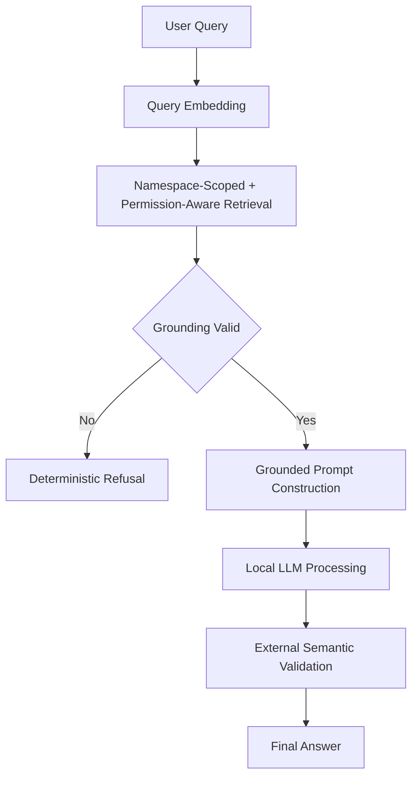

# Enterprise Knowledge Copilot

**Deterministic, permission-aware, grounded RAG system for enterprise environments**

## Overview

Enterprise Knowledge Copilot is an on-premises, enterprise-grade Retrieval-Augmented Generation (RAG) system designed to answer questions **only** when the underlying knowledge base explicitly supports the answer. Unlike typical chatbot-style RAG systems, this solution prioritizes correctness over fluency and deterministic refusal over hallucination.

### Core Philosophy

> Answers **only** when documents support it. Refuses deterministically otherwise.

## Key Features

- **Deterministic Refusal**: System refuses to answer when evidence is insufficient
- **Permission-Aware Retrieval**: Content access controlled by metadata filters before LLM interaction
- **Namespace Isolation**: Structural prevention of cross-document leakage
- **Semantic Grounding Validation**: External validator ensures answers are supported by retrieved context
- **Local-First Architecture**: 100% free, local models and infrastructure
- **Model-Agnostic Design**: Clean abstraction for swapping LLMs

## Architecture



## Quick Start

### 1. Install & Setup
```bash
# Install Ollama and pull model
curl -fsSL https://ollama.com/install.sh | sh
ollama serve

# Clone and install
git clone <repo>
cd enterprise-knowledge-copilot
python -m venv venv
source venv/bin/activate
pip install -r requirements.txt
mkdir -p data/chroma data/docs
```
### 2. Run
```bash
streamlit run app.py
```

## Project Structure
```bash
rag-copilot/
├── app.py
├── README.md
├── requirements.txt
├── index_docs.py
├── run_qa.py
├── data/
│   ├── chroma/
│   └── docs/
├── src/
│   ├── __init__.py
│   ├── qa_pipeline.py
│   ├── access_context.py
│   ├── embedder.py
│   ├── vector_store.py
│   ├── chunk.py
│   ├── load_pdf.py
│   ├── load_chunks.py
│   ├── llm/
│   │   ├── __init__.py
│   │   └── ollama_llm.py
│   ├── retrieval/
│   │   ├── __init__.py
│   │   └── retriever.py
│   ├── grounding/
│   │   ├── __init__.py
│   │   └── semantic_validator.py
│   └── prompting/
│       ├── __init__.py
│       └── grounded_prompt.py
```

## System Guarantees
- **Namespace Isolation** – Each collection separate, no merging
- **Permission Safety** – Unauthorized content never reaches LLM
- **Deterministic Refusal** – Fixed refusal message when unsure
- **External Validation** – Cosine similarity check post-LLM

##  Usage
- **Upload PDFs** (assign namespace & access level)
- **Query** with namespace and access level
- **Get** answer with citations OR refusal

## Example System Behavior

| Query Condition        | System Response                                                                 |
|------------------------|----------------------------------------------------------------------------------|
| Evidence available     | Returns a grounded answer with citations to retrieved chunks                     |
| No supporting evidence | Returns: *"The provided documents do not contain sufficient information to answer this question."* |
| Insufficient permission| Deterministic refusal with no content retrieval or information leakage           |

## Design Philosophy
"Better to be correct than helpful. Better to refuse than hallucinate."

## License
> MIT
